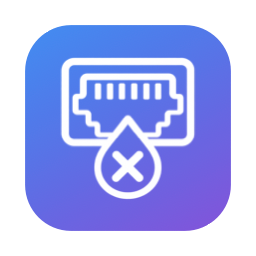
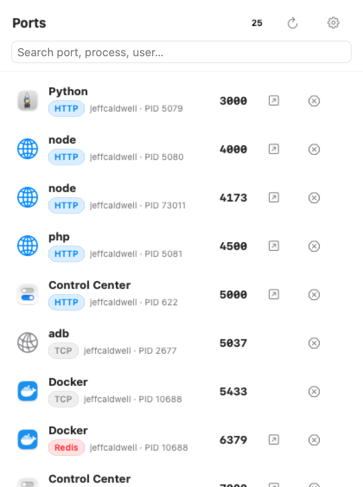

<p align="center">
  
</p>

<h1 align="center">PortDrop</h1>

<p align="center">
  A macOS menu-bar utility that lists every process listening on a local TCP port —<br>
  open it in one click, kill it in two.
</p>

<p align="center">
  <a href="https://github.com/jeffcaldwellca/portDrop/releases/latest"></a>
  <a href="https://github.com/jeffcaldwellca/portDrop/actions/workflows/ci.yml"></a>
  
  
</p>

<p align="center">
  <picture>
    <source media="(prefers-color-scheme: dark)" srcset="docs/screenshots/panel-dark.png">
    
  </picture>
</p>

## Install

With [Homebrew](https://brew.sh):

```sh
brew install --cask jeffcaldwellca/tap/portdrop
```

Or by hand:

1. Download `PortDrop-<version>.dmg` from the [latest release](https://github.com/jeffcaldwellca/portDrop/releases/latest).
2. Open it and drag **PortDrop** onto the **Applications** shortcut.

Then launch PortDrop from Applications or Spotlight. It lives in the menu bar — there's no Dock icon or window.

The app is signed with a Developer ID and notarized by Apple, so it opens without Gatekeeper warnings. Turn on **Launch at Login** from the ⚙︎ menu if you want it around permanently.

PortDrop keeps itself current with [Sparkle](https://sparkle-project.org): it checks for a new release once a day and offers to install it (⚙︎ → **Check for Updates…** to check now, or turn the automatic check off there). Homebrew installs update the same way; `brew upgrade` also works.

**Requires macOS 26 Tahoe or later.** To verify a download: `shasum -a 256 -c PortDrop-<version>.dmg.sha256`.

## What you get

- **Every listening TCP port**, live — polled with `lsof` every 2 s while the panel is open and every 10 s in the background.
- **Real app icons** via `NSRunningApplication` / bundle lookup, with SF Symbol fallbacks for daemons and CLI tools.
- **Service detection** by process name and well-known port (HTTP/S, SSH, FTP, PostgreSQL, MySQL, Redis, MongoDB, VNC, SMB, AFP…), plus a quick `HEAD` probe so unknown ports that speak HTTP get an `http://` link too.
- **Open** (↗) launches the service URL in its default handler — `http://`, `ssh://`, `postgresql://`, and so on.
- **Kill** (⊗), two steps so you never nuke the wrong thing:
  1. Click ⊗ → it becomes a red **Confirm** (reverts on its own after 3 s).
  2. Click **Confirm** → `SIGTERM`. Hold **⌥** while confirming for `SIGKILL`.

  If the process belongs to root or another user, PortDrop escalates to the standard macOS administrator-password dialog instead of failing silently.
- **Search** by port, process, user, or protocol.
- **Right-click** a row for Open, Copy URL / PID / host:port, Reveal in Finder, Kill, and Force Kill.
- **Menu-bar badge**: the PortDrop mark plus the number of listening ports.
- **Optional notification** when a new port starts listening.
- **Launch at Login** via `SMAppService`.

Nothing leaves your Mac: PortDrop only talks to `127.0.0.1`/`::1` for the HTTP probe, and it has no analytics, telemetry, or network dependencies.

## Build from source

Requires **Xcode 26** and [XcodeGen](https://github.com/yonaskolb/XcodeGen) (`brew install xcodegen`).

```sh
xcodegen generate
open PortDrop.xcodeproj                                          # or, from the terminal:
xcodebuild -scheme PortDrop -destination 'platform=macOS' test
```

The app is intentionally **not sandboxed** — `lsof` and `kill` need direct process access. The `PortDrop` scheme runs the unit tests in `PortDropTests`; CI runs the same command with ad-hoc signing on every push and pull request.

## Cutting a release

Releases are built, signed, notarized, and published by the [Release workflow](.github/workflows/release.yml) on a GitHub-hosted macOS 26 runner. The git tag is the version:

```sh
git tag v1.2.3
git push origin v1.2.3
```

That produces a GitHub Release with `PortDrop-1.2.3.dmg`, its `.sha256`, `PortDrop-1.2.3.zip` (the Sparkle update archive), `appcast.xml` (the Sparkle feed, with the release notes embedded — the app reads it via `releases/latest/download/appcast.xml`), and auto-generated notes; then it bumps the [Homebrew cask](https://github.com/jeffcaldwellca/homebrew-tap/blob/main/Casks/portdrop.rb) to match. `MARKETING_VERSION` comes from the tag; `CURRENT_PROJECT_VERSION` (the build number) is the workflow run number, so it always increases.

To try the pipeline without publishing anything, open **Actions → Release → Run workflow**: it builds, signs, and notarizes exactly the same way but uploads the DMG as a workflow artifact instead of creating a release.

The workflow needs five repository secrets (Settings → Secrets and variables → Actions):

| Secret | Value |
| --- | --- |
| `MACOS_CERTIFICATE` | Your **Developer ID Application** certificate *and* private key, exported from Keychain Access as a `.p12`, then `base64 -i cert.p12` |
| `MACOS_CERTIFICATE_PASSWORD` | The password you chose when exporting the `.p12` |
| `APPLE_API_KEY_ID` | Key ID of an App Store Connect API key (Users and Access → Integrations → Team Keys; the *Developer* role is enough) |
| `APPLE_API_ISSUER` | Issuer ID shown on the same page |
| `APPLE_API_KEY_P8` | Full contents of the downloaded `AuthKey_<KEY_ID>.p8` |
| `SPARKLE_PRIVATE_KEY` | The Sparkle EdDSA private key, exported with `generate_keys -x` (from the [Sparkle tools](https://github.com/sparkle-project/Sparkle/releases)). Its public half is `SPARKLE_PUBLIC_ED_KEY` in `project.yml`. |
| `TAP_TOKEN` *(optional)* | A GitHub token with **Contents: write** on `jeffcaldwellca/homebrew-tap`. Without it the release still publishes; the cask just isn't bumped (the workflow warns). |

### Releasing locally

The same script the workflow runs also works on your Mac. With the same App Store Connect key (the `.p8` is looked up at `~/.appstoreconnect/private_keys/AuthKey_<KEY_ID>.p8` unless `APPLE_API_KEY_PATH` says otherwise):

```sh
APPLE_API_KEY_ID=<key-id> APPLE_API_ISSUER=<issuer-id> Scripts/release.sh     # → dist/PortDrop-<version>.dmg (+ .sha256)
MARKETING_VERSION=1.2.3 APPLE_API_KEY_ID=… APPLE_API_ISSUER=… Scripts/release.sh   # override the version from project.yml
```

Without an API key, the script falls back to a `notarytool` keychain profile named `PortDrop` (one-time setup with an [app-specific password](https://account.apple.com)):

```sh
xcrun notarytool store-credentials PortDrop --apple-id <apple-id> --team-id 88ZPCYS252
Scripts/release.sh
```

The script notarizes and staples the app first, so the copy inside the DMG carries its own ticket, then builds the DMG and notarizes and staples that as well. It also leaves `dist/PortDrop-<version>.zip` for Sparkle; `Scripts/make-appcast.sh <zip> <private-key-file>` turns that into a signed `dist/appcast.xml`. To build just the drag-to-install DMG from an already-exported app:

```sh
Scripts/make-dmg.sh build/export/PortDrop.app dist/PortDrop.dmg
```

The DMG has a custom background (generated by `Scripts/make-dmg-background.swift`), the app and an **Applications** shortcut side by side, and the app icon as the volume icon.

## Branding

`Branding/PortDropIcon.png` is the single source of truth for the PortDrop mark. Everything else is derived from it:

```sh
swift Scripts/make-branding.swift      # → AppIcon.appiconset (10 sizes) + MenuBarIcon.imageset (1x/2x)
```

- **AppIcon** — the mark in white on the blue→purple brand squircle, on Apple's macOS icon grid. Also becomes the DMG's volume icon.
- **MenuBarIcon** — the bare mark as a 15×16 pt template image, so it inverts correctly in dark menu bars. `StatusBarLabel` composites it with the port count into one image.
- **DMG background** — `Scripts/make-dmg-background.swift` locks the mark up beside the wordmark.

Re-run the script after replacing the source artwork, then `xcodegen generate` and rebuild.

## Debug snapshot

The app can render its panel to a PNG and exit — handy for bug reports and for the screenshots above:

```sh
PORTDROP_SNAPSHOT=/tmp/panel.png PortDrop.app/Contents/MacOS/PortDrop
PORTDROP_SNAPSHOT=/tmp/panel-dark.png PORTDROP_SNAPSHOT_APPEARANCE=dark PORTDROP_SNAPSHOT_SCALE=2 PortDrop.app/Contents/MacOS/PortDrop
```

`PORTDROP_SNAPSHOT_APPEARANCE` is `light` (default) or `dark`; `PORTDROP_SNAPSHOT_SCALE` defaults to the screen's backing scale.
